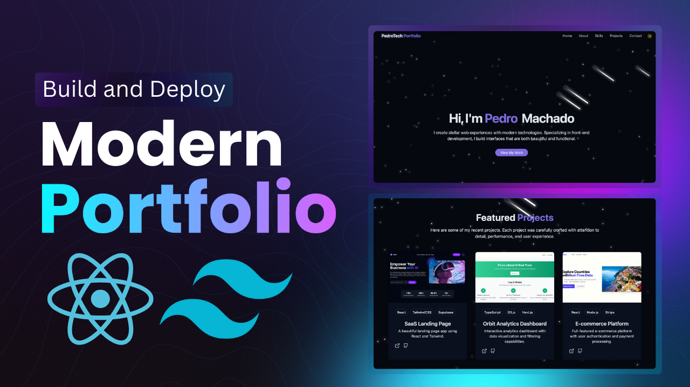

      
      
 <h3 align="center">My Personal Portfolio – Showcasing Projects, Skills & Experience</h3> 
 Live at <a href="https://rezwan00.github.io/Portfolio-Rezwan" target="_blank"><b>rezwan00.github.io/Portfolio-Rezwan</b></a> 
   

